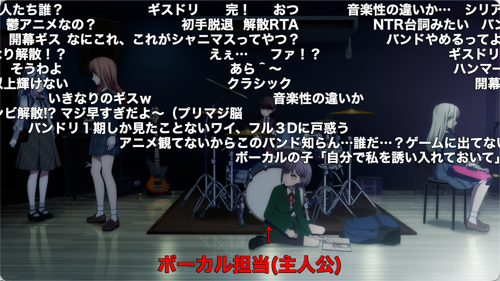
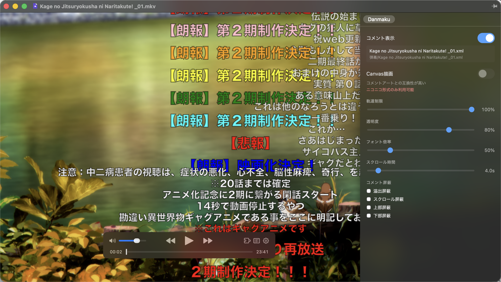
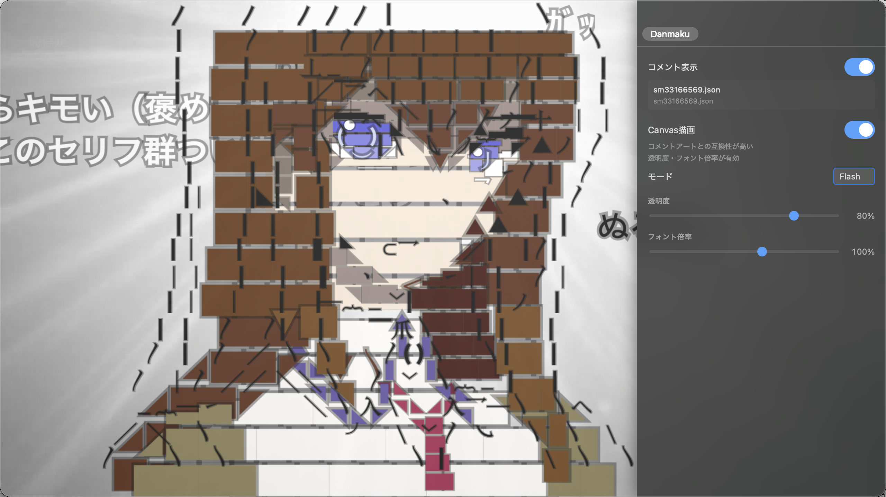

# Danmaku Cosmos

[日本語](#日本語) / [中文](#中文) / [English](#english)

| CSS Mode — Bilibili Danmaku | Canvas Mode — Niconico Comment Art |
|:---:|:---:|
|  |  |

> ※ 上图为演示用途，仅展示插件弹幕渲染效果。
> 实际使用时请自行从合法渠道获取 NicoNico 评论（コメント）。
> 本插件不提供任何弹幕文件。
>
> ※ This image is for demonstration only, showing the plugin's danmaku rendering.
> Please obtain NicoNico comments (コメント) from legitimate sources.
> This plugin does not provide any danmaku files.
>
> ※ この画像は演示用です。コメント描画の效果を示すものです。
> コメントは各自の責任において NicoNico など合法的なサービスから取得してください。
> このプラグインはコメントファイルを提供しません。

IINA 弹幕插件，支持 Niconico 和 Bilibili 格式弹幕，提供 CSS 和 Canvas 两种渲染模式。

---

## 中文

### 功能特性

- **双格式支持**：Niconico 格式（`<chat>` 标签 / v1 JSON）和 Bilibili 格式（`<d>` 标签）
- **双渲染模式**：
  - **CSS 模式**（默认，推荐）：完全自研的轻量级 DOM 渲染，流畅性最佳，支持透明度、字体缩放、滚动时长、弹幕屏蔽、轨道限制等完整设置
  - **Canvas 模式**：基于 [niconicomments](https://github.com/xpadev-net/niconicomments) 的 Canvas 渲染，对高级弹幕（コメントアート / Comment Art）兼容性更好，支持 Auto / HTML5 / Flash 三种模式。由于 IINA 使用 Safari (WebKit) 内核，Canvas 性能不如 CSS 模式，建议仅在需要高级弹幕兼容时使用
- **自动加载弹幕**：按优先级自动查找同目录下的弹幕文件
- **手动加载弹幕**：通过菜单或侧边栏手动选择弹幕文件
- **侧边栏控制面板**：实时调整透明度、字体缩放等参数
- **弹幕屏蔽**：支持屏蔽滚动/顶部/底部弹幕，过滤溢出弹幕
- **快捷键**：`D` 键快速切换弹幕显示

### 安装

1. 从 [Releases](https://github.com/karappo-yu/iina-plugin-danmaku-cosmos/releases) 下载 `.iinaplgz` 文件
2. 打开 IINA → 设置 → 插件 → 添加插件，选择下载的 `.iinaplgz` 文件
3. 重启 IINA

### 弹幕文件加载

#### 自动加载

插件会按以下优先级自动查找同目录下的弹幕文件：

1. **同名 JSON**：`video.mkv` → `video.json`
2. **同名 XML**：`video.mkv` → `video.xml`
3. **弹幕文件夹/同名**：`video.mkv` → `弹幕/video.xml`（支持 `弹幕` / `Comments` / `コメント` 三种文件夹名）
4. **弹幕文件夹/集数**：`video.mkv` → `弹幕/3.xml`（从文件名中自动提取集数）

#### 手动加载

- **侧边栏**：当未找到弹幕文件时，侧边栏会显示「手动加载弹幕」按钮
- **菜单栏**：插件 → Damaku Cosmos → 手动加载弹幕文件…

### 渲染模式

| 功能 | CSS 模式 | Canvas 模式 |
|------|---------|------------|
| 流畅性 | ✅ 最佳 | ⚠️ WebKit 下较弱 |
| 透明度 | ✅ | ✅ |
| 字体缩放 | ✅ | ❌ |
| 滚动时长 | ✅ | ❌ |
| 弹幕屏蔽 | ✅ | ❌ |
| 轨道限制 | ✅ | ❌ |
| 高级弹幕兼容 | ⚠️ 部分 | ✅ 完整 |
| Niconico 格式 | ✅ | ✅ (仅 JSON) |
| Bilibili 格式 | ✅ | ❌ |

> Canvas 模式仅支持 Niconico JSON 格式弹幕。打开新视频时默认使用 CSS 模式，需手动切换到 Canvas 模式。

### 支持的弹幕格式

| 格式 | CSS 模式 | Canvas 模式 |
|------|---------|------------|
| Niconico XML | ✅ | ❌ |
| Niconico JSON | ✅ | ✅ |
| Bilibili XML | ✅ | ❌ |

### 注意事项

- **默认字体说明**：CSS 模式的默认字体为 `Hiragino Sans / Noto Sans JP`，属于日文字体。中文字体表现可能不佳（如显示为楷体风格的宋体），推荐中文弹幕用户在偏好设置中将字体改为 `Microsoft YaHei`（微软雅黑）、`PingFang SC`（苹方-简）或 `Noto Sans JP` 等支持中日韩文字的字体
- 文件名包含特殊字符（如 `[`、`]`）可能导致自动加载失败
- 最小化窗口后再恢复，弹幕会重新渲染（已知限制）

---

## 日本語

### 機能

- **2フォーマット対応**：Niconico 形式（`<chat>` タグ / v1 JSON）と Bilibili 形式（`<d>` タグ）
- **2つの描画モード**：
  - **CSS モード**（デフォルト・推奨）：完全自作の軽量 DOM 描画。最も滑らかで、透明度・フォント倍率・スクロール時間・コメント屏蔽・軌道制限など完全な設定をサポート
  - **Canvas モード**：[niconicomments](https://github.com/xpadev-net/niconicomments) ベースの Canvas 描画。コメントアートとの互換性が高く、Auto / HTML5 / Flash の3モードをサポート。IINA は Safari (WebKit) エンジンを使用するため、Canvas のパフォーマンスは CSS モードに劣ります。コメントアート互換が必要な場合のみ使用を推奨
- **自動読み込み**：同じフォルダから優先順位に従って自動検索
- **手動読み込み**：メニューやサイドバーからコメントファイルを選択
- **サイドバーコントロール**：透明度・フォント倍率などのパラメータをリアルタイム調整
- **コメント屏蔽**：スクロール・上部・下部コメントの屏蔽、溢出屏蔽をサポート
- **ショートカット**：`D` キーでコメント表示切替

### インストール

1. [Releases](https://github.com/karappo-yu/iina-plugin-danmaku-cosmos/releases) から `.iinaplgz` ファイルをダウンロード
2. IINA → 設定 → プラグイン → プラグインを追加 で `.iinaplgz` ファイルを選択
3. IINA を再起動

### コメントファイルの読み込み

#### 自動読み込み

同じフォルダから以下の優先順位で自動検索：

1. **同名の JSON**：`video.mkv` → `video.json`
2. **同名の XML**：`video.mkv` → `video.xml`
3. **コメント/同名**：`video.mkv` → `コメント/video.xml`（`弾幕` / `Comments` / `コメント` フォルダ名に対応）
4. **コメント/番号**：`video.mkv` → `コメント/3.xml`（ファイル名から話数を抽出）

#### 手動読み込み

- **サイドバー**：コメントファイルが見つからない場合、「コメント読込」ボタンが表示されます
- **メニュー**：プラグイン → Damaku Cosmos → コメントファイルを読み込む…

### 描画モード

| 機能 | CSS モード | Canvas モード |
|------|-----------|--------------|
| 滑らかさ | ✅ 最適 | ⚠️ WebKit で低下 |
| 透明度 | ✅ | ✅ |
| フォント倍率 | ✅ | ❌ |
| スクロール時間 | ✅ | ❌ |
| コメント屏蔽 | ✅ | ❌ |
| 軌道制限 | ✅ | ❌ |
| コメントアート互換 | ⚠️ 一部 | ✅ 完全 |
| Niconico 形式 | ✅ | ✅ (JSON のみ) |
| Bilibili 形式 | ✅ | ❌ |

> Canvas モードは Niconico JSON 形式のコメントのみ対応です。新しい動画を開くとデフォルトで CSS モードになります。Canvas モードへの切り替えは手動で行ってください。

### 対応形式

| 形式 | CSS モード | Canvas モード |
|------|-----------|--------------|
| Niconico XML | ✅ | ❌ |
| Niconico JSON | ✅ | ✅ |
| Bilibili XML | ✅ | ❌ |

### 注意事項

- **デフォルトフォントについて**：CSS モードのデフォルトフォントは `Hiragino Sans / Noto Sans JP` で、日本語のフォントです。中国語の文字表示が最適でない場合があります（楷体風の宋体など）。中国語のコメントを使用する場合は、偏好設定でフォントを `Microsoft YaHei`、`PingFang SC`、`Noto Sans JP` など中日韓の文字をサポートするフォントに変更することをお勧めします
- ファイル名に特殊文字（`[`、`]`など）が含まれる場合、自動読み込みに失敗する可能性がある
- ウィンドウを最小化してから復元すると、コメントが再レンダリングされる（既知の制限）

---

## English

### Features

- **Dual format support**: Niconico format (`<chat>` tags / v1 JSON) and Bilibili format (`<d>` tags)
- **Dual rendering modes**:
  - **CSS mode** (default, recommended): Fully self-developed lightweight DOM rendering with the best smoothness. Supports full settings — opacity, font scale, scroll duration, danmaku blocking, lane limit
  - **Canvas mode**: Canvas rendering based on [niconicomments](https://github.com/xpadev-net/niconicomments), with better Comment Art compatibility. Supports Auto / HTML5 / Flash modes. Since IINA uses the Safari (WebKit) engine, Canvas performance is lower than CSS mode. Recommended only when Comment Art compatibility is needed
- **Auto-load danmaku**: Automatically searches for danmaku files in the same directory by priority
- **Manual load**: Select danmaku files via menu or sidebar
- **Sidebar control panel**: Real-time adjustment of opacity, font scale, and other parameters
- **Danmaku blocking**: Block scroll/top/bottom danmaku, filter overflow
- **Keyboard shortcut**: Press `D` to toggle danmaku visibility

### Installation

1. Download the `.iinaplgz` file from [Releases](https://github.com/karappo-yu/iina-plugin-danmaku-cosmos/releases)
2. Open IINA → Preferences → Plugins → Add Plugin, select the `.iinaplgz` file
3. Restart IINA

### Loading Comment Files

#### Auto Load

Automatically searches in the same directory with this priority:

1. **Same name JSON**: `video.mkv` → `video.json`
2. **Same name XML**: `video.mkv` → `video.xml`
3. **Comments/Same name**: `video.mkv` → `Comments/video.xml` (supports `弹幕` / `Comments` / `コメント` folder names)
4. **Comments/Number**: `video.mkv` → `Comments/3.xml` (extracts episode number from filename)

#### Manual Load

- **Sidebar**: When no danmaku file is found, a "Load Danmaku" button appears in the sidebar
- **Menu**: Plugins → Damaku Cosmos → Load Comment File…

### Rendering Modes

| Feature | CSS Mode | Canvas Mode |
|---------|----------|-------------|
| Smoothness | ✅ Best | ⚠️ Weaker on WebKit |
| Opacity | ✅ | ✅ |
| Font Scale | ✅ | ❌ |
| Scroll Duration | ✅ | ❌ |
| Danmaku Blocking | ✅ | ❌ |
| Lane Limit | ✅ | ❌ |
| Comment Art Compat | ⚠️ Partial | ✅ Full |
| Niconico Format | ✅ | ✅ (JSON only) |
| Bilibili Format | ✅ | ❌ |

> Canvas mode only supports Niconico JSON format danmaku. New videos default to CSS mode; switch to Canvas mode manually.

### Supported Formats

| Format | CSS Mode | Canvas Mode |
|--------|----------|-------------|
| Niconico XML | ✅ | ❌ |
| Niconico JSON | ✅ | ✅ |
| Bilibili XML | ✅ | ❌ |

### Notes

- **Default font**: The default font in CSS mode is `Hiragino Sans / Noto Sans JP`, a Japanese font. Chinese characters may not render well (e.g., displaying as Songti with a Kai-style appearance). Chinese danmaku users are recommended to change the font in preferences to `Microsoft YaHei`, `PingFang SC`, or `Noto Sans JP` for better CJK support
- Filenames with special characters (like `[`, `]`) may cause auto-load to fail
- Minimizing and restoring the window causes danmaku to re-render (known limitation)

---

## Third-Party Libraries

This project uses the following open-source libraries:

| Library | License | Repository |
|---------|---------|------------|
| [niconicomments](https://github.com/xpadev-net/niconicomments) | MIT | https://github.com/xpadev-net/niconicomments |
| [niconicomments-plugin-niwango](https://github.com/xpadev-net/niconicomments-plugin-niwango) | MIT | https://github.com/xpadev-net/niconicomments-plugin-niwango |
| [niwango.js](https://github.com/xpadev-net/niwango.js) | MIT | https://github.com/xpadev-net/niwango.js |

All three libraries are licensed under the MIT License. The MIT License requires that the copyright notice and license text be included in any distribution that includes the library. This project complies with this requirement by retaining the original license information bundled within the minified files.

### MIT License Compliance

The MIT License requires:

1. **Include the copyright notice** — The original copyright notices are preserved in the bundled minified JavaScript files distributed with this plugin
2. **Include the license text** — The MIT License text is included in each library's source repository (linked above)
3. **No warranty** — The libraries are provided "as is" without warranty

For the full text of the MIT License, see: https://opensource.org/licenses/MIT

### Patent Notice (niconicomments)

The niconicomments author notes that implementing the complete flow of "real-time comment fetching → screen rendering → comment posting" may involve Japanese patents, regardless of whether this library is used. See [ABOUT_PATENT.md](https://github.com/xpadev-net/niconicomments/blob/develop/ABOUT_PATENT.md) for details.

This plugin is used solely for local playback of saved comment files and does not involve real-time fetching or posting functionality, so it does not fall under the above patent concerns.

---

## License

This project is licensed under the MIT License.
