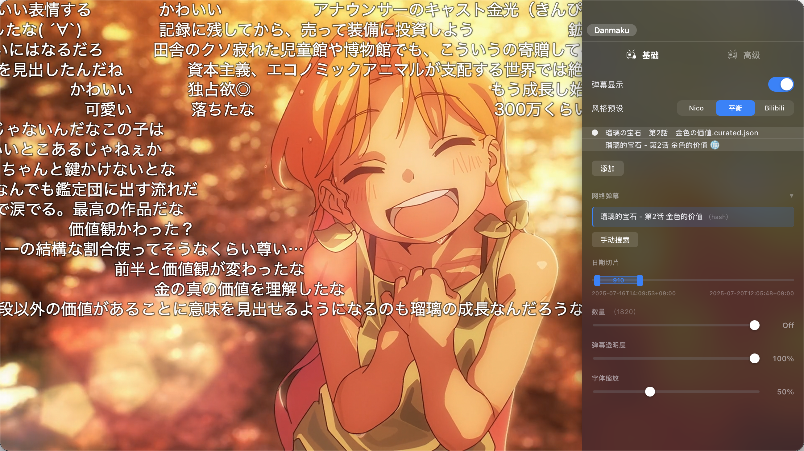
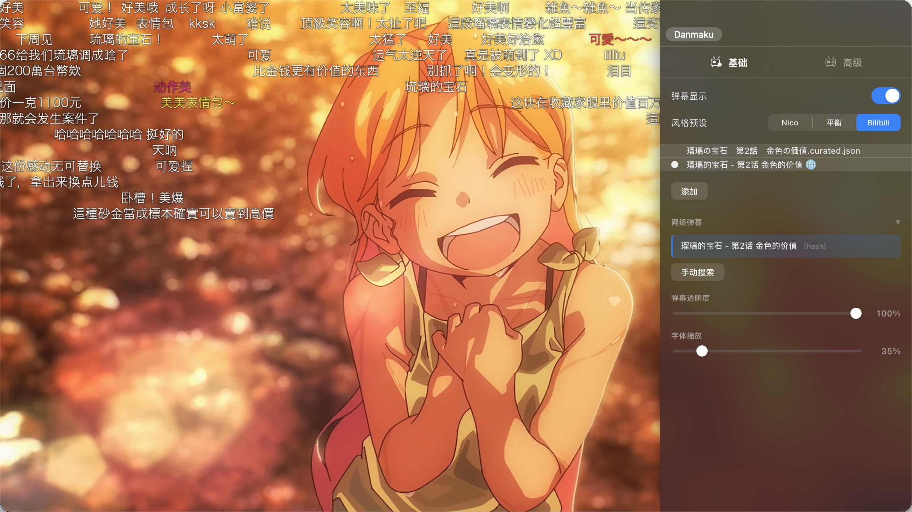
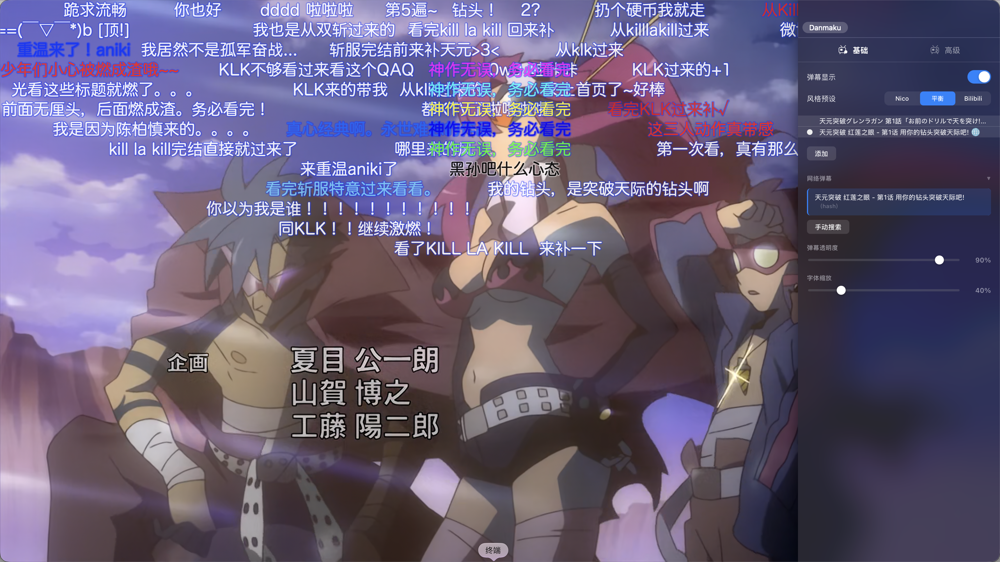

# Danmaku Cosmos

[日本語](#日本語) / [中文](#中文) / [English](#english)

IINA 弹幕插件，基于 [niconicomments](https://github.com/xpadev-net/niconicomments)（已 fork 增强）。支持 Niconico 格式（XML / V1 JSON）、Bilibili XML、以及**弹弹play 网络弹幕**。CSS 和 Canvas 双渲染模式。

---

## 中文

### 安装

1. 安装 [IINA](https://iina.io/)（如尚未安装）
2. 从 [Releases](https://github.com/karappo-yu/iina-plugin-danmaku-cosmos/releases) 下载 `.iinaplgz` 文件
3. 打开 IINA → 设置 → 插件 → 添加插件，选择下载的 `.iinaplgz` 文件
4. 重启 IINA

### 功能特性

- **Niconico 格式完整支持**：Niconico XML、Niconico V1 JSON
- **Bilibili XML 基础支持**：普通滚动弹幕、顶部/底部固定弹幕，可通过风格预设切换 niconico 或 Bilibili 渲染风格
- **弹弹play 网络弹幕**：自动匹配视频文件，从弹弹play API 获取网络弹幕，支持缓存和手动搜索
- **繁简转换**：支持强制将繁体中文弹幕转换为简体中文，可在设置和 UI 中自由切换
- **双渲染模式**：
  - **CSS 模式**（默认）：利用 WebKit GPU 合成加速（`transform` + `will-change`），在 IINA 的 WKWebView 环境下流畅度远超 Canvas
  - **Canvas 模式**：基于魔改 niconicomments，用于需要完整 Canvas 渲染的场合
- **自动加载弹幕**：按优先级自动查找同目录下的弹幕文件
- **手动加载弹幕**：通过菜单或侧边栏手动选择弹幕文件
- **侧边栏控制面板**：实时调整弹幕开关、渲染模式、繁简转换、透明度、字体缩放、滚动速度等
- **弹幕时间偏移**：在高级设置中可手动输入偏移秒数，或按 A / D 键快速回退/前进，用于调整弹幕显示时间
- **自动设置片头偏移**：加载 Niconico V1 JSON 弹幕时，自动检测弹幕源时长与当前视频时长的差异。当片源开头包含 Aniplex 等供应商片头导致视频比原始弹幕源更长时，自动设置偏移量跳过片头。差值小于 1 秒视为一致（弹幕源时长仅精确到秒）。可在高级设置中关闭自动设置——关闭后仍会检测并在侧边栏以红字提醒时长不一致，但不再自动设置偏移。**仅对 Niconico V1 JSON 格式有效**，且弹幕文件中需包含 `thread` 的 `fork: "main"` 和 `duration` 字段（Niconico 官方导出的 JSON 不含 `duration`，需由自定义下载器写入）。这是对 V1 JSON 格式的可选增强，不影响标准 V1 JSON 的正常读取，也不影响其他弹幕格式——不使用 Niconico JSON 的用户无需关注此开关
- **弹幕过滤面板**：侧边栏新增「过滤」tab——弹幕时间轴浏览、屏蔽词、去重合并、点击跳转
- **快捷键**：`Shift + D` 显示/隐藏弹幕
- **弹幕字体设置**：在高级设置中可选择字体预设（日文/中文字体）或自定义字体，并可调节粗细，用于调整弹幕的显示效果
- **滚动速度控制**：在高级设置中可调节滚动弹幕的速度（25%~100%，仅调慢），固定弹幕不受影响

### 风格调节

弹幕外观可通过自定义选项自由组合：

- **niconico 原生风格**（引擎默认）：字号大、滚动快、字重较粗
- **中文弹幕常见风格**：字体小、滚动慢、字重较细

普通设置顶部的「风格预设」可一键切换：

- **Nico**：恢复全部默认值（字体缩放 100%、粗细 400、描边 2.8px、滚动速度 100%）
- **平衡（Balanced）**：字体缩放 50%、粗细 400、描边 3px、滚动速度 50%
- **Bilibili**：字体缩放 35%、粗细 200、描边 2.5px、滚动速度 40%

也可通过「字体缩放」「滚动速度」「字体粗细」等选项手动微调。

### 截图

niconico 风格：

Balanced 风格：

Bilibili 风格：

自定义风格：

CA 弹幕：

### 网络弹幕

插件集成了弹弹play（dandanplay）开放平台 API，可自动为视频匹配并加载网络弹幕。

- **自动匹配**：优先根据文件 hash 精确匹配（自动加载），失败后根据视频文件名匹配（显示候选列表供选择）
- **手动搜索**：上述匹配均失败时，可手动搜索番剧名称，从搜索结果中选择
- **弹幕缓存**：网络弹幕缓存到本地，24 小时内重复播放无需重新下载
- **自动加载开关**：开启后自动匹配并加载网络弹幕；关闭时优先使用本地弹幕，网络弹幕仅在手动选择时加载
- **弹幕冲突处理**：网络弹幕和本地弹幕同时存在时，根据优先级自动选择

> **注意**：弹弹play 提供的网络弹幕内容以简体中文和繁体中文为主，不包含其他语言。若习惯阅读简体，可开启“强制繁转简”选项。

### 渲染模式

| 模式 | 说明 | 推荐场景 |
|------|------|----------|
| **CSS**（默认） | DOM 元素 + CSS 动画，WebKit GPU 加速 | IINA 播放（推荐） |
| **Canvas** | Canvas 2D 渲染，niconicomments 引擎 | CSS 模式效果不理想时 |

在侧边栏「高级设置」中切换渲染模式。

### 弹幕过滤

侧边栏新增「过滤」tab，提供弹幕时间轴浏览与过滤功能：

- **时间轴列表**：虚拟滚动，数万条弹幕流畅浏览；跟随播放位置实时滚动，高亮当前屏幕上的弹幕
- **屏蔽词**：标签式屏蔽词列表，支持正则；被屏蔽的弹幕在列表中以删除线标记，且不参与渲染
- **去重**：将设定时间窗内的相同弹幕合并为「原文xN」并自动配色；固定弹幕支持渐进合并（x2/x3）
- **点击跳转**：点击时间戳跳转视频到对应位置；弹幕文本内的时间（如「空降 01:39」）也可点击跳转

### 弹幕文件加载

#### 自动加载

插件会按以下优先级自动查找同目录下的弹幕文件：

1. **同名 JSON**：`video.mkv` → `video.json`
2. **同名 XML**：`video.mkv` → `video.xml`
3. **弹幕文件夹/同名**：`video.mkv` → `弹幕/video.xml`（支持 `弹幕` / `Comments` / `コメント` 三种文件夹名）
4. **弹幕文件夹/集数**：`video[3].mkv` → `弹幕/comment[3].xml`（正则匹配从文件名中自动提取集数，很多时候特殊格式会不起作用）

#### 手动加载

- **侧边栏**：点击「添加」按钮选择弹幕文件
- **菜单栏**：插件 → Danmaku → 手动加载弹幕文件…

### 注意事项

- 本插件以 niconico 弹幕风格为核心，Bilibili 等中文弹幕默认以 niconico 风格渲染，可通过风格预设切换为 Bilibili 风格；不支持 Bilibili 高级弹幕、代码弹幕、BAS 弹幕等特有功能
- CSS 模式下字符画（コメントアート）的垂直位置可能与 Canvas 模式略有差异
- Canvas 模式下字符画在 IINA 的 WebKit 渲染中可能出现错位（Safari canvas 2D 无 GPU 加速）
- 文件名包含特殊字符（如 `[`、`]`）可能导致自动加载失败

---

## 日本語

> **注意**：本プラグインは niconico コメントスタイルを中心に設計されており、Bilibili など中国語コメントフォーマットのサポートは限定的です。中国語コメントは既定で niconico スタイルで描画され、スタイルプリセットで Bilibili スタイルに切り替え可能です。Bilibili 固有の高度なコメント（mode 7）、スクリプトコメント（mode 8）、BAS コメント（mode 9）などには対応していません。

### インストール

1. [IINA](https://iina.io/) をインストール（未インストールの場合）
2. [Releases](https://github.com/karappo-yu/iina-plugin-danmaku-cosmos/releases) から `.iinaplgz` ファイルをダウンロード
3. IINA → 設定 → プラグイン → プラグインを追加 で `.iinaplgz` ファイルを選択
4. IINA を再起動

### 機能

- **Niconico フォーマット完全対応**：Niconico XML、Niconico V1 JSON
- **Bilibili XML 基本対応**：通常スクロールコメント、上部/下部固定コメント。スタイルプリセットで niconico / Bilibili スタイルを選択可能
- **弹弹play ネットワークコメント**：動画ファイルを自動認識し、弹弹play API からネットワークコメントを取得。キャッシュ対応、手動検索可能
- **繁体字から簡体字への変換**：繁体字中国語のコメントを強制的に簡体字に変換する機能を追加。設定および UI から切り替え可能
- **デュアル描画モード**：
  - **CSS モード**（デフォルト）：WebKit GPU 合成加速（`transform` + `will-change`）により、IINA の WKWebView で Canvas より滑らかに描画
  - **Canvas モード**：改造 niconicomments、Canvas 描画が必要な場合に使用
- **自動読み込み**：同じフォルダから優先順位に従って自動検索
- **手動読み込み**：メニューやサイドバーからコメントファイルを選択
- **サイドバーコントロール**：コメント表示、描画モード、繁簡変換、透明度、フォント倍率、スクロール速度などをリアルタイム調整
- **コメントタイムオフセット**：詳細設定で秒数を入力したり、A / D キーで素早く巻き戻し／進めることができ、コメントの表示時間を調整できます
- **オフセット自動設定**：Niconico V1 JSON コメント読み込み時に、コメントソースの長さと現在の動画の長さの差異を自動検出します。Aniplex などの配給ロゴにより動画が元のコメントソースより長い場合、オフセットを自動設定して冒頭をスキップします。差が 1 秒未満は一致とみなします（コメントソースの長さは秒単位まで）。詳細設定で自動設定をオフにできます——オフでも検出とサイドバーの赤字による長さ不一致の通知は行われますが、オフセットの自動設定は行いません。**Niconico V1 JSON フォーマットのみ対応**。コメントファイルの `thread` に `fork: "main"` と `duration` フィールドが必要です（Niconico 公式のエクスポート JSON には `duration` が含まれず、カスタムダウンローダーで書き込む必要があります）。これは V1 JSON フォーマットに対するオプションの拡張であり、標準 V1 JSON の読み込みや他のコメントフォーマットには影響しません——Niconico JSON を使用しないユーザーはこのトグルを気にする必要はありません
- **コメントフィルタパネル**：サイドバーに新しい「フィルター」タブを追加——コメントタイムライン表示、NGワード、重複マージ、クリックでジャンプ
- **ショートカット**：`Shift + D` でコメントの表示/非表示を切り替え
- **コメントフォント設定**：詳細設定でフォント（日本語・中国語フォントのプリセットやカスタム）と太さを選択でき、コメントの表示効果を調整できます
- **スクロール速度調整**：詳細設定でスクロールコメントの速度を調整できます（25%〜100%、減速のみ）。固定コメントには影響しません

### スタイル調整

コメントの外観はカスタムオプションで自由に組み合わせられます：

- **niconico ネイティブスタイル**（エンジン既定）：フォントが大きく、スクロールが速く、字が太い
- **中国語コメントによくあるスタイル**：フォントが小さく、スクロールが遅く、字が細い

通常設定の上部にある「スタイルプリセット」でワンクリック切り替え：

- **Nico**：全項目を既定値に戻す（フォント倍率 100%、太さ 400、縁取り 2.8px、スクロール速度 100%）
- **バランス**：フォント倍率 50%、太さ 400、縁取り 3px、スクロール速度 50%
- **Bilibili**：フォント倍率 35%、太さ 200、縁取り 2.5px、スクロール速度 40%

「フォント倍率」「スクロール速度」「フォントの太さ」などのオプションで手動微調整も可能です。

### コメントフィルター

サイドバーの新しい「フィルター」タブで、コメントタイムラインの表示とフィルターを提供します：

- **タイムライン一覧**：仮想スクロールにより数万件のコメントもスムーズに表示。再生位置に追従してスクロールし、現在画面上のコメントをハイライト
- **NGワード**：タグ形式のNGワード一覧、正規表現対応。NG判定されたコメントは一覧上で取り消し線表示となり、描画からも除外
- **重複排除**：設定した時間窓内の同一コメントを「原文xN」に統合して自動着色。固定コメントは段階的マージ（x2/x3）に対応
- **クリックでジャンプ**：タイムスタンプをクリックすると動画の該当位置へジャンプ。コメント本文内の時刻（例：「空降 01:39」）もクリックでジャンプ可能

### ネットワークコメント

弹弹play（dandanplay）プラットフォームの API を統合し、動画にネットワークコメントを自動マッチングして読み込みます。

- **自動マッチング**：ファイルハッシュによる完全一致（自動読み込み）→ ファイル名による曖昧一致（候補一覧表示）の順で試行
- **手動検索**：上記が全て失敗した場合、番組名を手動検索可能
- **キャッシュ**：ネットワークコメントはローカルにキャッシュされ、24時間以内の再再生では再ダウンロード不要
- **自動読み込みトグル**：ON で自動マッチング＋自動読み込み、OFF では優先的にローカルコメントを使用
- **競合処理**：ネットワークコメントとローカルコメントが共存する場合、優先設定に従って自動選択

> **注意**：弹弹play から提供されるネットワークコメントは簡体字中国語・繁体字中国語が主体で、他の言語は含まれません。

### コメントファイルの読み込み

#### 自動読み込み

同じフォルダから以下の優先順位で自動検索：

1. **同名の JSON**：`video.mkv` → `video.json`
2. **同名の XML**：`video.mkv` → `video.xml`
3. **コメント/同名**：`video.mkv` → `コメント/video.xml`（`弾幕` / `Comments` / `コメント` フォルダ名に対応）
4. **コメント/番号**：`video[3].mkv` → `コメント/comment[3].xml`（正規表現でファイル名から話数を抽出。特殊な形式では機能しないことが多い）

#### 手動読み込み

- **サイドバー**：「追加」ボタンからコメントファイルを選択
- **メニュー**：プラグイン → Danmaku → コメントファイルを読み込む…

---

## English

> **Note**: This plugin is designed around the niconico comment style. Bilibili and other Chinese danmaku formats have limited support — they are rendered in niconico style by default, switchable to Bilibili style via Style Preset. Bilibili-specific features like advanced comments (mode 7), scripting comments (mode 8), and BAS comments (mode 9) are not supported.

### Installation

1. Install [IINA](https://iina.io/) if you haven't already
2. Download the `.iinaplgz` file from [Releases](https://github.com/karappo-yu/iina-plugin-danmaku-cosmos/releases)
3. Open IINA → Preferences → Plugins → Add Plugin, select the `.iinaplgz` file
4. Restart IINA

### Features

- **Full Niconico format support**: Niconico XML, Niconico V1 JSON
- **Basic Bilibili XML support**: Normal scrolling, top/bottom fixed comments; render style switchable via Style Preset (niconico or Bilibili)
- **Dandanplay network danmaku**: Auto-match videos via dandanplay API, with caching and manual search
- **Traditional to Simplified Chinese Conversion**: Option to force convert Traditional Chinese danmaku to Simplified Chinese, configurable in settings and UI
- **Dual rendering modes**:
  - **CSS mode** (default): DOM elements + CSS animations with WebKit GPU acceleration for smooth rendering in IINA's WKWebView
  - **Canvas mode**: Based on a forked niconicomments library, for when Canvas rendering is needed
- **Auto-load**: Automatically searches for danmaku files in the same directory by priority
- **Manual load**: Select danmaku files via menu or sidebar
- **Sidebar control panel**: Real-time adjustment of danmaku visibility, render mode, Chinese conversion, opacity, font scale, scroll speed, and more
- **Danmaku time offset**: Adjust timing in Advanced settings by entering a seconds offset, or use A / D keys to quickly rewind or advance to change the display timing of danmaku
- **Auto set intro offset**: When loading Niconico V1 JSON danmaku, automatically detects the duration difference between the danmaku source and the current video. When the video is longer than the original danmaku source (e.g. due to Aniplex distributor logos at the start), automatically sets an offset to skip the intro. Differences under 1 second are treated as consistent (danmaku source duration is only second-precision). Auto-setting can be disabled in Advanced settings — when disabled, detection and a red-text warning in the sidebar still occur, but the offset is no longer applied automatically. **Only works with Niconico V1 JSON format**, and requires the danmaku file's `thread` to contain `fork: "main"` and `duration` fields (Niconico's official export JSON does not include `duration`; it must be injected by a custom downloader). This is an optional enhancement to the V1 JSON format — it does not affect standard V1 JSON loading or other danmaku formats, so users not using Niconico JSON can ignore this toggle
- **Danmaku filter panel**: New "Filter" tab in the sidebar — danmaku timeline browser, blocklist, dedupe merging, click-to-seek
- **Shortcut**: Press `Shift + D` to show/hide danmaku
- **Danmaku font settings**: Choose a font (Japanese/Chinese presets or custom) and weight in Advanced settings to adjust the danmaku appearance
- **Scroll speed control**: Adjust the scrolling danmaku speed in Advanced settings (25%–100%, slow-down only); fixed comments are unaffected

### Style Adjustment

Danmaku appearance can be freely combined via the customization options:

- **Native niconico style** (engine default): large font, fast scrolling, bold weight
- **Common Chinese danmaku style**: small font, slow scrolling, thin weight

The **Style Preset** dropdown at the top of the general settings applies presets in one click:

- **Nico**: restores all defaults (Font Scale 100%, Weight 400, Stroke Width 2.8px, Scroll Speed 100%)
- **Balanced**: Font Scale 50%, Weight 400, Stroke Width 3px, Scroll Speed 50%
- **Bilibili**: Font Scale 35%, Weight 200, Stroke Width 2.5px, Scroll Speed 40%

Manual fine-tuning is also available via **Font Scale**, **Scroll Speed**, and **Weight**.

### Network Danmaku

The plugin integrates the dandanplay open platform API for automatic network danmaku matching and loading.

- **Auto-match**: First tries file hash (auto-load on exact match), then falls back to filename matching (shows candidate list)
- **Manual search**: Search by anime name when both matching methods fail
- **Cache**: Network danmaku is cached locally; replay within 24 hours skips re-download
- **Auto-load toggle**: ON for automatic network matching + loading; OFF prefers local files
- **Conflict resolution**: When both local and network danmaku exist, priority setting determines which to use

> **Note**: Network danmaku provided by Dandanplay is predominantly Simplified Chinese and Traditional Chinese — other languages are not available.

### Render Modes

| Mode | Description | Recommended For |
|------|-------------|-----------------|
| **CSS** (default) | DOM elements + CSS animations with WebKit GPU acceleration | IINA playback (recommended) |
| **Canvas** | Canvas 2D rendering via niconicomments engine | When CSS mode doesn't suit |

Toggle between modes in the sidebar's Advanced settings.

### Danmaku Filter

A new **Filter** tab in the sidebar provides a danmaku timeline browser with filtering:

- **Timeline list**: Virtual scrolling keeps tens of thousands of danmaku smooth; live-follows playback position and highlights danmaku currently on screen
- **Block words**: Tag-list blocklist with regex support; blocked danmaku are shown with strikethrough in the list and excluded from rendering
- **Dedupe**: Merges identical danmaku within a configurable time window into `text xN` with auto-coloring; fixed comments support progressive merging (x2/x3)
- **Click-to-seek**: Click a timestamp to seek the video to that position; times inside danmaku text (e.g. `空降 01:39`) are also clickable

### Loading Comment Files

#### Auto Load

Automatically searches in the same directory with this priority:

1. **Same name JSON**: `video.mkv` → `video.json`
2. **Same name XML**: `video.mkv` → `video.xml`
3. **Comments/Same name**: `video.mkv` → `Comments/video.xml` (supports `弹幕` / `Comments` / `コメント` folder names)
4. **Comments/Number**: `video[3].mkv` → `Comments/comment[3].xml` (extracts the episode number from the filename via regex; often fails with special filename formats)

#### Manual Load

- **Sidebar**: Click "Add" to select danmaku files
- **Menu**: Plugins → Danmaku → Load Comment File…

### Notes

- This plugin is designed around the niconico comment style. Bilibili and other Chinese danmaku formats have limited support — they are rendered in niconico style, and Bilibili-specific features like advanced comments (mode 7), scripting comments (mode 8), and BAS comments (mode 9) are not supported
- Comment Art (CA) vertical positioning may differ slightly between CSS and Canvas modes
- Canvas mode CA may appear misaligned in IINA's WebKit renderer (Safari canvas 2D lacks GPU acceleration)
- Filenames with special characters (like `[`, `]`) may cause auto-load to fail
- Minimizing and restoring the window causes danmaku to re-render (known limitation)

---

## Third-Party Libraries

| Library | License | Repository |
|---------|---------|------------|
| [niconicomments](https://github.com/xpadev-net/niconicomments) (forked with CSS renderer) | MIT | https://github.com/karappo-yu/niconicomments |
| [opencc-js](https://github.com/nk2028/opencc-js) v1.4.1 (UMD bundle, loaded locally) | MIT | https://github.com/nk2028/opencc-js |

The MIT License requires that the copyright notice and license text be included in any distribution. The original copyright notices are preserved in the bundled minified JavaScript files distributed with this plugin.

### Patent Notice

The niconicomments author notes that implementing the complete flow of "real-time comment fetching → screen rendering → comment posting" may involve Japanese patents. See [ABOUT_PATENT.md](https://github.com/xpadev-net/niconicomments/blob/develop/ABOUT_PATENT.md) for details.

This plugin is used solely for local playback of saved comment files and does not involve real-time fetching or posting functionality.

---

## License

MIT License.